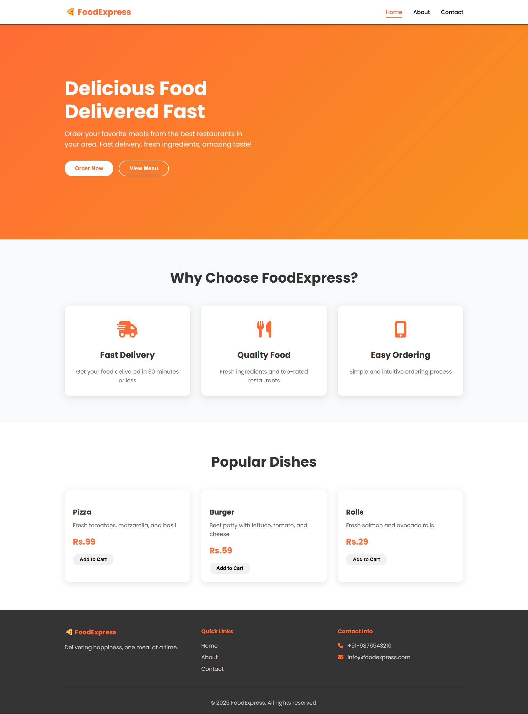
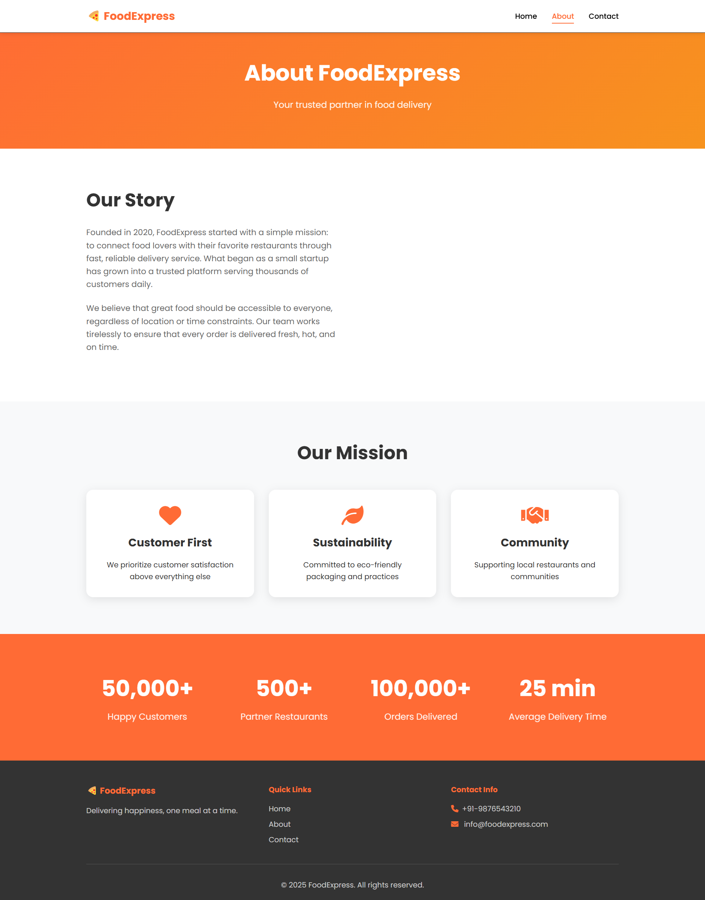

# 🍕 FoodExpress

**FoodExpress** is a responsive food delivery website built using HTML, CSS, and JavaScript. It features smooth scrolling, animations, interactive contact forms, and simulated cart functionality.

## 📸 Screenshots

| Home Page | About Page | Contact Page |
|-----------|------------|--------------|
|  |  |  |

> 📁 _Make sure to add screenshots in the `assets/` folder and update the file names above accordingly._

## 🚀 Features

- ✅ Responsive navigation menu
- ✅ Animated scroll effects
- ✅ Contact form validation with notifications
- ✅ Add-to-cart simulation
- ✅ Smooth scrolling for internal links
- ✅ Lazy loading for images
- ✅ Notification system for feedback

## 🧱 Project Structure

```

📁 FoodExpress/
├── index.html
├── about.html
├── contact.html
├── main.js
├── main.css
├── responsive.css
├── assets/
│   ├── home.png
│   ├── about.png
│   └── contact.png
└── README.md

````

## 📂 How to Use

1. **Clone the Repository**
   ```bash
   git clone https://github.com/prathmeshkumb/Food-Devlivery.git
````

2. **Open the Project**

   * Open `index.html` in your browser to view the home page.

3. **Customize**

   * Replace placeholder images with your own in the `assets/` folder.
   * Modify CSS/JS as needed.

## 🧪 Technologies Used

* HTML5
* CSS3 (Responsive Design)
* JavaScript (Vanilla)


Would you like me to generate a folder-ready version of this README or help you export/upload screenshots?
```
